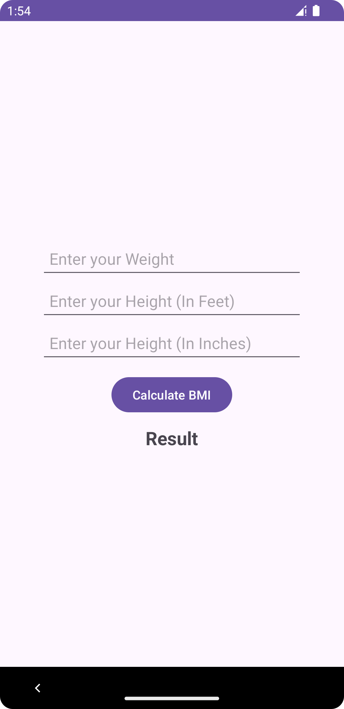
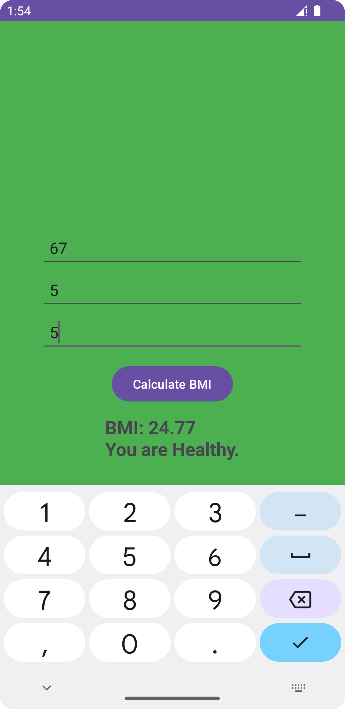
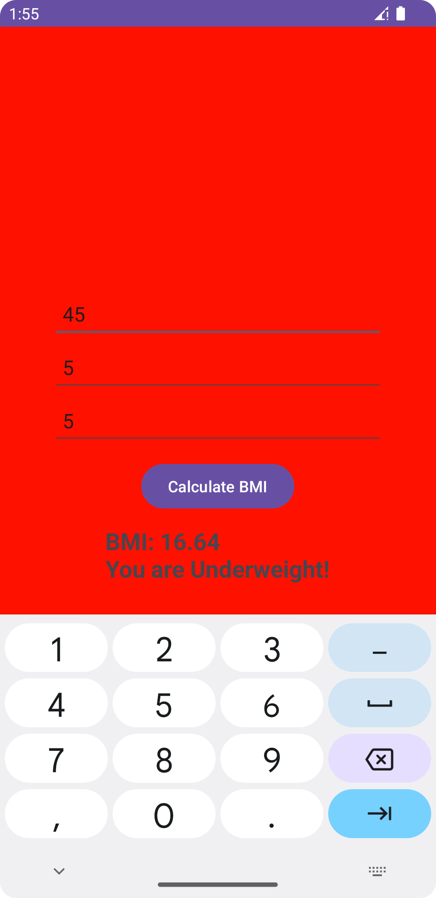
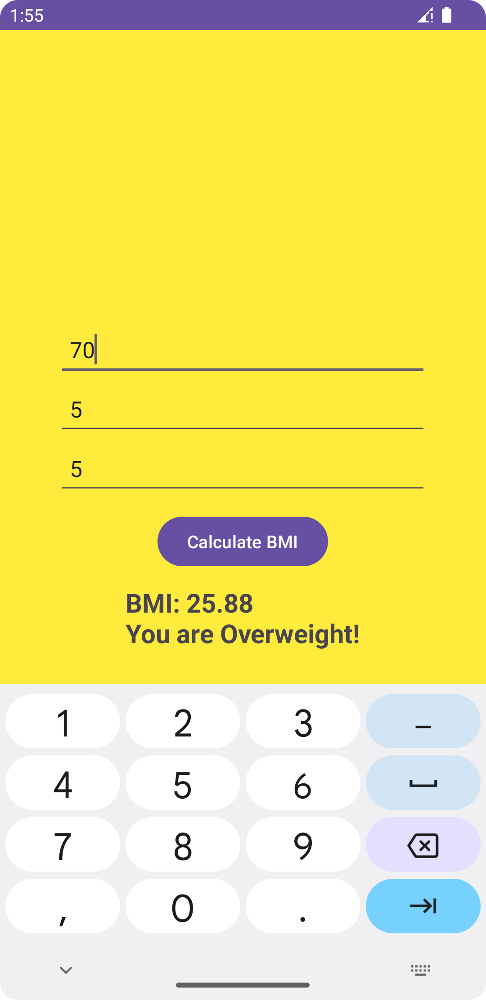

# BMI Calculator

A simple BMI (Body Mass Index) calculator app developed for Android. This app allows users to input their weight and height, and it calculates their BMI, displaying the result along with a message indicating whether they are underweight, normal weight, or overweight.

## Features

- User-friendly interface for inputting weight and height.
- BMI calculation based on the entered values.
- Displays BMI value along with a corresponding message.
- Background color changes based on BMI results.

## Screenshots

### Main Screen


### Result Screens
  


## Technologies Used

- Android SDK
- Java
- XML for layout design

## Installation

1. Clone the repository:
   ```bash
   git clone https://github.com/ShahriarKhanLimon/BMI_Calculator_App.git
2.  Open the project in Android Studio.
3. Run the app on an Android emulator or physical device.

## Usage
1. Open the app.
2. Enter your weight in the appropriate field.
3. Enter your height in feet and inches.
4. Click the "Calculate BMI" button to see your BMI and the corresponding category.
